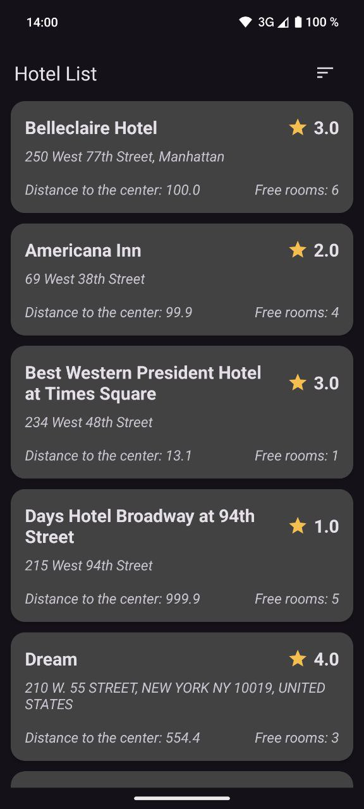
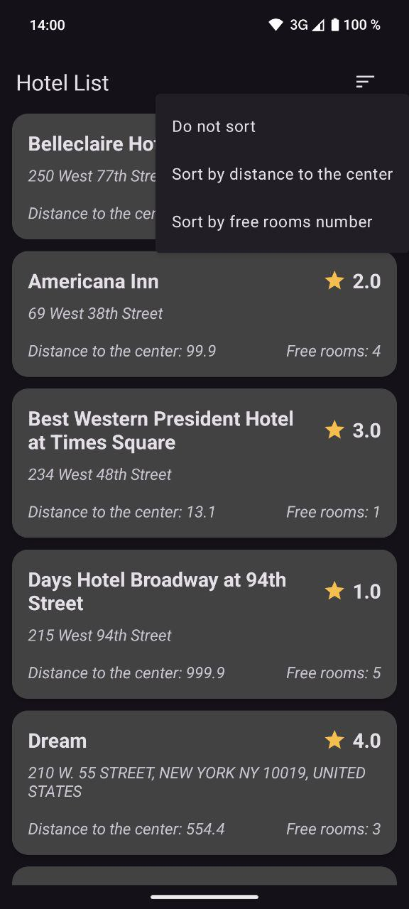
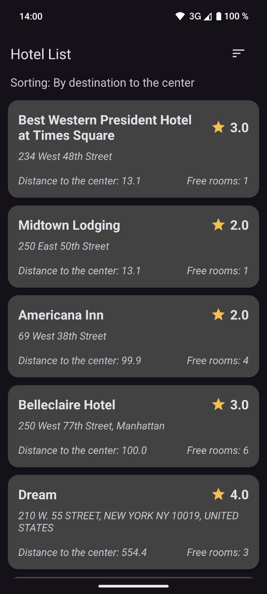
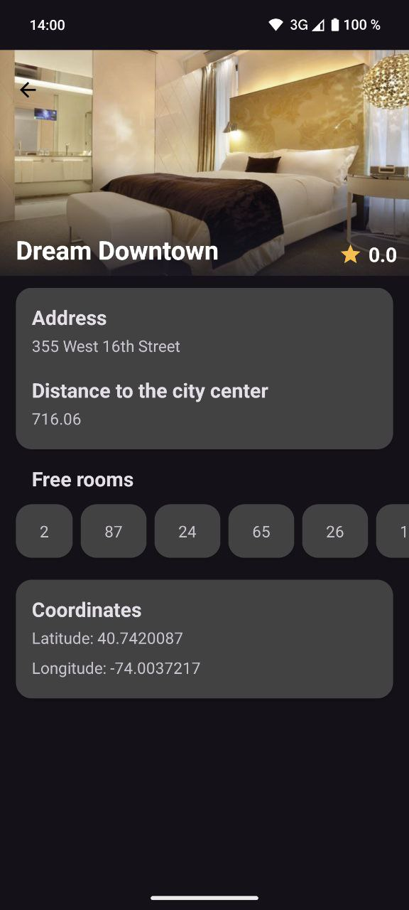
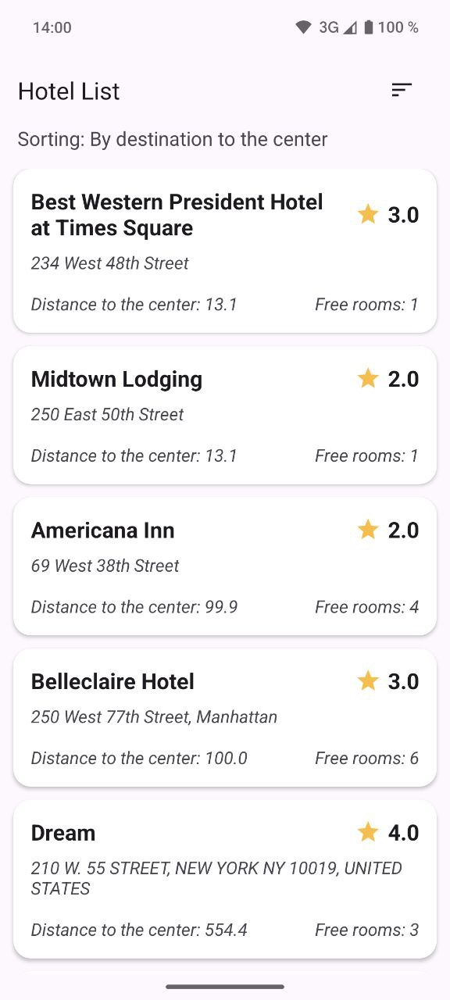
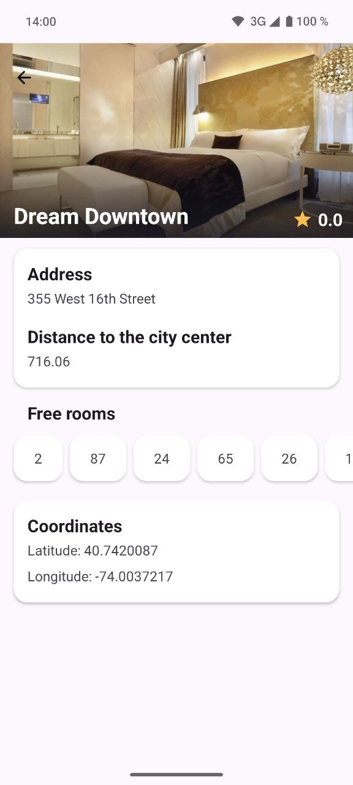
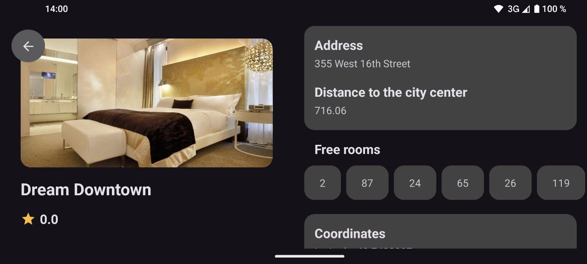
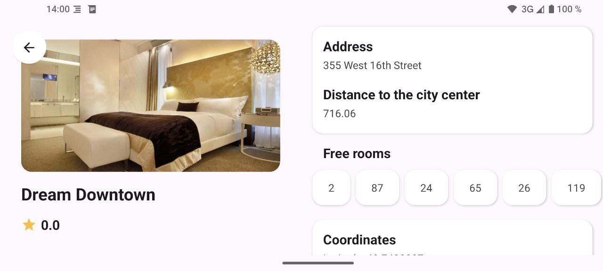

# Hotel list
Приложение для отображения информации об отелях

<a href>

</a>
<a href>








</a>


# Инструкция по запуску

-   Для сборки использовать Android Studio Jellyfish 2023.3.1 или новее
    -   Версия Android Gradle Pluging не ниже 8.4.1

- В файл `local.properties` в корне проекта положить константы `BASE_URL` и `IMAGE_BASE_URL`
```
BASE_URL="https://<ваш_base_url>"
IMAGE_BASE_URL="https://<ваш_image_base_url>"
```

- Собрать приложение


# Описание реализации

Состоит из 2 страниц

1. Экран списка отелей
2. Экран деталей отеля

## Экран списка отелей

- Выводятся данные о списке отелей
- Добавлена возможность отсортировать отели по одному из двух параметров: по расстоянию отеля от центра города или по количеству свободных номеров
  - Первичная сортировка совпадает с выдачей с сервера

## Экран деталей отеля

- Отображается подбробная информация об отеле
- Граница изображения в 1px обрезается и не отображается на экране

## Общее

- Система Android 8.0 и выше (minSdkVersion 26)
- Ориентации – портретная и ландшафтная
- Темы – темная и светлая
- Поддержан swipe-to-refresh
- Ошибки сети обрабатываются и отображаются на экране в виде всплывающих уведомлений (toast)
- Полученные из сети данные кэшируются в базу данных и из базы передаются на ui
- Написаны unit тесты на логику обработки полученных данных
- Приложение разделено на модули


# Использованные технологии и подходы

- Язык: Kotlin
- Работа с сетью: Retrofit, OkHttp
- Сериализация: Kotlinx Serialization
- БД: Room, SQLite
- Многопоточность: Coroutines, Flow
- DI: Dagger
- Отображение: View, ViewBinding
- Навигация: Fragment manager
- Архитектура презентационного слоя: MVVM
- Загрузка изображений: Coil
- Тестирование: Junit4, Mockk, Turbine 

